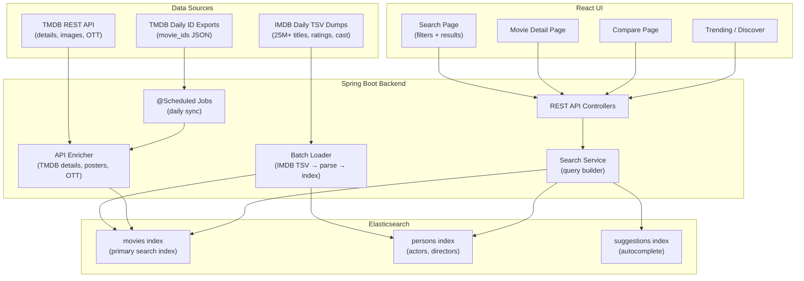

# SearchCraft — Indian Cinema Search Engine

> **Stack**: Spring Boot + Elasticsearch + React  
> **Data Sources**: TMDB API + IMDB Datasets  
> **Focus**: Master every major Elasticsearch concept through a movie search engine with strong Indian cinema support

---

## Architecture Overview



---

## Data Strategy

### Phase 1: IMDB Bulk Load (Foundation)

Download and parse IMDB daily TSV dumps to seed the index with comprehensive data:

| File | Records | What You Extract |
|------|---------|-----------------|
| `title.basics.tsv.gz` | ~25.9M titles (filter to ~700K movies) | Title, year, runtime, genres |
| `title.ratings.tsv.gz` | ~1.5M rated titles | Average rating, vote count |
| `title.akas.tsv.gz` | ~40M rows | Hindi/Tamil/Telugu/etc. titles (region=`IN`, language=`hi`/`ta`/`te`) |
| `title.principals.tsv.gz` | ~80M rows | Top cast & crew per movie |
| `name.basics.tsv.gz` | ~13M people | Actor/director names, professions |
| `title.crew.tsv.gz` | All titles | Director and writer IDs |

**Filter strategy**: Only index `titleType == 'movie'` with `numVotes >= 50` to keep the index manageable (~200K-300K quality movies).

### Phase 2: TMDB API Enrichment (Rich Metadata)

For each movie in the index, call TMDB to enrich with data IMDB doesn't have:

```
GET /3/movie/{tmdb_id}?append_to_response=credits,watch/providers,keywords,images
```

| Field | Source | Why |
|-------|--------|-----|
| Poster/backdrop images | TMDB | IMDB has no image API |
| Plot overview | TMDB | Richer than IMDB's data |
| OTT availability (IN) | TMDB (JustWatch) | "Where to watch in India" |
| Budget & revenue | TMDB | Box office data |
| Keywords/tags | TMDB | Better search & discovery |
| Production companies | TMDB | Studio filtering |

**ID Mapping**: IMDB `tconst` → TMDB `id` via TMDB's daily export files (`movie_ids_MM_DD_YYYY.json.gz`) which contain `imdb_id` cross-references.

### Phase 3: Scheduled Daily Sync

```
┌─────────────────────────────────────────────────┐
│  Daily @Scheduled Job (2 AM IST)                │
│                                                 │
│  1. Download TMDB daily ID export               │
│  2. Diff against existing index                 │
│  3. Fetch details for new/updated movies        │
│  4. Bulk index into Elasticsearch               │
│  5. Re-download IMDB ratings weekly (for        │
│     updated vote counts & averages)             │
└─────────────────────────────────────────────────┘
```

---

## Elasticsearch Index Design

### `movies` Index — Mapping

```json
{
  "settings": {
    "number_of_shards": 1,
    "number_of_replicas": 0,
    "analysis": {
      "analyzer": {
        "title_analyzer": {
          "type": "custom",
          "tokenizer": "standard",
          "filter": ["lowercase", "asciifolding", "title_synonyms"]
        },
        "hindi_analyzer": {
          "type": "custom",
          "tokenizer": "standard",
          "filter": ["lowercase", "indic_normalization", "hindi_normalization", "hindi_stemmer"]
        },
        "autocomplete_analyzer": {
          "type": "custom",
          "tokenizer": "standard",
          "filter": ["lowercase", "asciifolding", "autocomplete_filter"]
        },
        "search_analyzer": {
          "type": "custom",
          "tokenizer": "standard",
          "filter": ["lowercase", "asciifolding"]
        }
      },
      "filter": {
        "autocomplete_filter": {
          "type": "edge_ngram",
          "min_gram": 2,
          "max_gram": 15
        },
        "title_synonyms": {
          "type": "synonym",
          "synonyms": [
            "sci-fi, science fiction, sf",
            "rom-com, romantic comedy",
            "biopic, biography, biographical"
          ]
        },
        "hindi_stemmer": {
          "type": "stemmer",
          "language": "hindi"
        }
      }
    }
  },
  "mappings": {
    "properties": {
      "imdb_id":          { "type": "keyword" },
      "tmdb_id":          { "type": "integer" },
      "title":            { "type": "text", "analyzer": "title_analyzer",
                            "fields": {
                              "keyword": { "type": "keyword" },
                              "autocomplete": { "type": "text", "analyzer": "autocomplete_analyzer", "search_analyzer": "search_analyzer" }
                            }},
      "original_title":   { "type": "text", "analyzer": "standard" },
      "title_hindi":      { "type": "text", "analyzer": "hindi_analyzer" },
      "title_tamil":      { "type": "text", "analyzer": "standard" },
      "title_telugu":     { "type": "text", "analyzer": "standard" },
      "all_titles":       { "type": "text", "analyzer": "title_analyzer" },
      "overview":         { "type": "text", "analyzer": "standard" },
      "tagline":          { "type": "text" },
      "year":             { "type": "integer" },
      "release_date":     { "type": "date", "format": "yyyy-MM-dd" },
      "decade":           { "type": "keyword" },
      "runtime_minutes":  { "type": "integer" },
      "genres":           { "type": "keyword" },
      "original_language":{ "type": "keyword" },
      "spoken_languages": { "type": "keyword" },
      "imdb_rating":      { "type": "float" },
      "imdb_votes":       { "type": "integer" },
      "tmdb_rating":      { "type": "float" },
      "tmdb_votes":       { "type": "integer" },
      "popularity":       { "type": "float" },
      "budget_usd":       { "type": "long" },
      "revenue_usd":      { "type": "long" },
      "poster_path":      { "type": "keyword", "index": false },
      "backdrop_path":    { "type": "keyword", "index": false },
      "keywords":         { "type": "keyword" },
      "production_companies": { "type": "keyword" },
      "production_countries": { "type": "keyword" },
      "is_indian":        { "type": "boolean" },

      "cast": {
        "type": "nested",
        "properties": {
          "person_id":    { "type": "keyword" },
          "name":         { "type": "text", "fields": { "keyword": { "type": "keyword" } } },
          "character":    { "type": "text" },
          "order":        { "type": "integer" },
          "profile_path": { "type": "keyword", "index": false }
        }
      },

      "crew": {
        "type": "nested",
        "properties": {
          "person_id":    { "type": "keyword" },
          "name":         { "type": "text", "fields": { "keyword": { "type": "keyword" } } },
          "job":          { "type": "keyword" },
          "department":   { "type": "keyword" }
        }
      },

      "watch_providers_in": {
        "type": "nested",
        "properties": {
          "provider_name": { "type": "keyword" },
          "provider_type": { "type": "keyword" },
          "logo_path":     { "type": "keyword", "index": false }
        }
      },

      "last_updated":     { "type": "date" }
    }
  }
}
```

### ES Concepts Covered by This Mapping

| Concept | Where It's Used |
|---------|----------------|
| **Custom analyzers** | `title_analyzer`, `hindi_analyzer`, `autocomplete_analyzer` |
| **Multi-fields** | `title.keyword`, `title.autocomplete` |
| **Edge-ngram** | Autocomplete on title |
| **Synonym filter** | "sci-fi" = "science fiction" |
| **Nested objects** | `cast`, `crew`, `watch_providers_in` |
| **Keyword vs text** | `genres` (keyword for exact facets) vs `overview` (text for full-text) |
| **Non-indexed fields** | `poster_path` (stored but not searchable) |
| **Date types** | `release_date`, `last_updated` |
| **Numeric ranges** | `runtime_minutes`, `imdb_rating`, `budget_usd` |

---

## Spring Boot Project Structure

```
searchcraft/
├── pom.xml (parent)
├── searchcraft-core/
│   ├── src/main/java/com/searchcraft/core/
│   │   ├── model/           # Movie, Person, WatchProvider (ES document models)
│   │   ├── dto/             # SearchRequest, SearchResponse, MovieDetail DTOs
│   │   └── config/          # ElasticsearchConfig, RestClientConfig
│   └── pom.xml
├── searchcraft-ingestion/
│   ├── src/main/java/com/searchcraft/ingestion/
│   │   ├── imdb/            # ImdbTsvParser, ImdbBulkLoader
│   │   ├── tmdb/            # TmdbApiClient, TmdbEnricher, TmdbIdMapper
│   │   ├── scheduler/       # DailySyncScheduler
│   │   └── pipeline/        # IngestionPipeline (orchestrates load → enrich → index)
│   └── pom.xml
├── searchcraft-search/
│   ├── src/main/java/com/searchcraft/search/
│   │   ├── service/         # MovieSearchService, AutocompleteService
│   │   ├── query/           # QueryBuilder helpers (bool, function_score, nested)
│   │   └── aggregation/     # AggregationBuilder helpers (facets, stats)
│   └── pom.xml
├── searchcraft-api/
│   ├── src/main/java/com/searchcraft/api/
│   │   ├── controller/      # SearchController, MovieController, IngestionController
│   │   ├── exception/       # GlobalExceptionHandler
│   │   └── config/          # WebConfig, CorsConfig, SwaggerConfig
│   ├── src/main/resources/
│   │   ├── application.yml
│   │   └── elasticsearch/   # index mappings JSON files
│   └── pom.xml
└── searchcraft-ui/          # React frontend (separate module or repo)
    ├── package.json
    ├── src/
    │   ├── components/      # SearchBar, FilterPanel, MovieCard, CompareView
    │   ├── pages/           # SearchPage, MovieDetailPage, ComparePage, TrendingPage
    │   ├── hooks/           # useSearch, useDebounce, useFilters
    │   └── api/             # searchApi.js (Axios wrapper)
    └── public/
```

### Key Dependencies

```xml
<!-- Spring Boot Starter -->
<dependency>
    <groupId>org.springframework.boot</groupId>
    <artifactId>spring-boot-starter-web</artifactId>
</dependency>

<!-- Elasticsearch Java Client (new official client) -->
<dependency>
    <groupId>co.elastic.clients</groupId>
    <artifactId>elasticsearch-java</artifactId>
</dependency>

<!-- Spring Data Elasticsearch (optional, for repository pattern) -->
<dependency>
    <groupId>org.springframework.boot</groupId>
    <artifactId>spring-boot-starter-data-elasticsearch</artifactId>
</dependency>

<!-- OpenAPI / Swagger -->
<dependency>
    <groupId>org.springdoc</groupId>
    <artifactId>springdoc-openapi-starter-webmvc-ui</artifactId>
</dependency>

<!-- WebClient for TMDB API calls -->
<dependency>
    <groupId>org.springframework.boot</groupId>
    <artifactId>spring-boot-starter-webflux</artifactId>
</dependency>
```

---

## Search API Design

### Endpoints

| # | Method | Endpoint | Description | ES Concept |
|---|--------|----------|-------------|------------|
| 1 | `GET` | `/api/v1/search` | Full-text search with filters | `bool` query, `function_score` |
| 2 | `GET` | `/api/v1/autocomplete` | Search-as-you-type suggestions | `edge_ngram`, `completion` suggester |
| 3 | `GET` | `/api/v1/movies/{id}` | Movie detail by ID | `get` by ID |
| 4 | `GET` | `/api/v1/movies/compare` | Side-by-side compare (2-4 movies) | `multi_get` |
| 5 | `GET` | `/api/v1/facets` | Available filter values with counts | `terms` aggregation |
| 6 | `GET` | `/api/v1/discover` | Browse by filters (no search text) | `bool` filter, `range`, `terms` |
| 7 | `GET` | `/api/v1/stats` | Aggregated stats (avg rating by decade, etc.) | `stats`, `histogram`, `date_histogram` |
| 8 | `GET` | `/api/v1/similar/{id}` | Find similar movies | `more_like_this` query |

### Search Request — Full Example

```
GET /api/v1/search?q=thriller&genres=Crime,Drama&language=hi&yearFrom=2015&yearTo=2025
    &ratingMin=7.0&runtimeMax=180&watchProvider=Netflix&sortBy=rating&page=1&size=20
```

### ES Query Built by Backend (for the above request)

```json
{
  "query": {
    "function_score": {
      "query": {
        "bool": {
          "must": [
            {
              "multi_match": {
                "query": "thriller",
                "fields": ["title^3", "title_hindi^2", "all_titles^2", "overview", "keywords"],
                "type": "best_fields",
                "fuzziness": "AUTO"
              }
            }
          ],
          "filter": [
            { "terms": { "genres": ["Crime", "Drama"] } },
            { "term": { "original_language": "hi" } },
            { "range": { "year": { "gte": 2015, "lte": 2025 } } },
            { "range": { "imdb_rating": { "gte": 7.0 } } },
            { "range": { "runtime_minutes": { "lte": 180 } } },
            {
              "nested": {
                "path": "watch_providers_in",
                "query": { "term": { "watch_providers_in.provider_name": "Netflix" } }
              }
            }
          ]
        }
      },
      "functions": [
        { "field_value_factor": { "field": "popularity", "modifier": "log1p", "factor": 0.5 } },
        { "field_value_factor": { "field": "imdb_votes", "modifier": "log1p", "factor": 0.2 } },
        { "gauss": { "release_date": { "origin": "now", "scale": "1825d", "decay": 0.5 } } }
      ],
      "boost_mode": "multiply",
      "score_mode": "sum"
    }
  },
  "aggs": {
    "genres": { "terms": { "field": "genres", "size": 20 } },
    "languages": { "terms": { "field": "original_language", "size": 15 } },
    "decades": { "terms": { "field": "decade", "size": 15 } },
    "rating_histogram": { "histogram": { "field": "imdb_rating", "interval": 1 } },
    "watch_providers": {
      "nested": { "path": "watch_providers_in" },
      "aggs": { "providers": { "terms": { "field": "watch_providers_in.provider_name", "size": 10 } } }
    }
  },
  "highlight": {
    "fields": {
      "overview": { "fragment_size": 150, "number_of_fragments": 2 },
      "title": {}
    }
  },
  "from": 0,
  "size": 20,
  "sort": [
    { "imdb_rating": { "order": "desc" } },
    "_score"
  ]
}
```

### ES Concepts Covered by Search API

| Concept | Where It's Used |
|---------|----------------|
| **Bool query** | Combining must + filter clauses |
| **Multi-match** | Searching across title, overview, keywords |
| **Fuzzy matching** | `fuzziness: AUTO` for typo tolerance |
| **Function score** | Boosting by popularity, votes, recency |
| **Decay functions** | Gaussian decay on release_date (prefer recent) |
| **Nested query** | Filtering by watch provider, cast member |
| **Range query** | Year, rating, runtime ranges |
| **Terms aggregation** | Faceted counts for genres, languages |
| **Histogram aggregation** | Rating distribution |
| **Highlighting** | Bold matching text in overview |
| **More Like This** | Find similar movies by content |
| **Edge-ngram** | Autocomplete suggestions |
| **Sorting** | Multi-field sort (rating + relevance) |

---

## React UI — Key Pages

### 1. Search Page (Main)

```
┌──────────────────────────────────────────────────────────────┐
│  🔍 [Search movies, actors, directors...          ] [Search] │
│     Autocomplete dropdown appears as you type                │
├────────────────┬─────────────────────────────────────────────┤
│  FILTERS       │  Results: 1,247 movies found                │
│                │  Sort: [Relevance ▼] [Rating] [Year] [Votes]│
│  ▼ Genre       │                                             │
│  ☑ Thriller    │  ┌─────────┬──────────────────────────────┐ │
│  ☑ Drama       │  │ [poster]│ Andhadhun (2018)      ⭐ 8.3 │ │
│  ☐ Action      │  │         │ Crime, Thriller · Hindi      │ │
│  ☐ Comedy      │  │         │ A pianist who fakes ...       │ │
│                │  │         │ 📺 Netflix, Prime    [Compare]│ │
│  ▼ Language    │  └─────────┴──────────────────────────────┘ │
│  ☑ Hindi       │  ┌─────────┬──────────────────────────────┐ │
│  ☐ Tamil       │  │ [poster]│ Drishyam (2015)       ⭐ 8.2 │ │
│  ☐ Telugu      │  │         │ ...                          │ │
│  ☐ English     │  └─────────┴──────────────────────────────┘ │
│                │                                             │
│  ▼ Year Range  │  ◄ 1  2  3  4  5 ... 62 ►                  │
│  [2015] - [2025]│                                            │
│                │                                             │
│  ▼ Rating      │                                             │
│  [7.0] ━━━━━━  │                                             │
│                │                                             │
│  ▼ Watch On    │                                             │
│  ☐ Netflix     │                                             │
│  ☐ Prime Video │                                             │
│  ☐ Hotstar     │                                             │
│  ☐ Jio Cinema  │                                             │
└────────────────┴─────────────────────────────────────────────┘
```

### 2. Movie Detail Page

Shows full details, cast carousel, similar movies, and OTT availability.

### 3. Compare Page

Side-by-side comparison of 2-4 movies across all attributes (rating, runtime, cast, genre, OTT).

### 4. Discover / Trending Page

Browse by decade, language, genre with visualizations (rating distribution charts, top movies per decade).

---

## Phased Build Plan

### Phase 1 — Foundation (Week 1-2)
> **Goal**: Get data into Elasticsearch and searchable

| Task | ES Concepts Learned |
|------|-------------------|
| Set up Spring Boot multi-module project | Project structure |
| Set up Elasticsearch (Docker) | Cluster basics, REST API |
| Design and create `movies` index with mappings | Mappings, analyzers, data types |
| Build IMDB TSV parser (title.basics + title.ratings) | — |
| Bulk index ~200K movies into ES | Bulk API, indexing performance |
| Build basic search endpoint (`/api/v1/search`) | Bool query, multi-match |
| Basic React search page (text input + results list) | — |

### Phase 2 — Rich Search (Week 3-4)
> **Goal**: Faceted search, filters, and relevance tuning

| Task | ES Concepts Learned |
|------|-------------------|
| Add genre, language, year filters | Terms filter, range query |
| Build faceted sidebar with aggregation counts | Terms aggregation, nested aggregation |
| Implement `function_score` relevance tuning | Function score, decay functions, field_value_factor |
| Add fuzzy matching and typo tolerance | Fuzziness, Levenshtein distance |
| Add search result highlighting | Highlight API |
| Implement sorting (rating, year, votes, relevance) | Multi-field sort |
| Parse and index IMDB `title.akas` for Indian language titles | Multi-language search |

### Phase 3 — Enrichment & Autocomplete (Week 5-6)
> **Goal**: TMDB integration, autocomplete, nested data

| Task | ES Concepts Learned |
|------|-------------------|
| Build TMDB API client (WebClient + rate limiting) | — |
| Map IMDB IDs → TMDB IDs via daily exports | — |
| Enrich movies with posters, overviews, OTT, cast | — |
| Index cast/crew as nested objects | Nested mappings, nested queries |
| Build "Search by actor/director" using nested queries | Nested query, inner_hits |
| Implement autocomplete with edge-ngram | Edge-ngram, search-as-you-type |
| Build daily sync scheduler | @Scheduled, bulk update API |

### Phase 4 — Advanced Features (Week 7-8)
> **Goal**: Discovery, comparison, analytics

| Task | ES Concepts Learned |
|------|-------------------|
| "More Like This" similar movies | MLT query |
| Compare page (multi-get) | Multi-get API |
| Stats/analytics page (avg rating by decade, genre distribution) | Stats, histogram, date_histogram aggregations |
| OTT provider filter (nested aggregation) | Nested aggregation |
| Synonym search ("sci-fi" = "science fiction") | Synonym token filter |
| Percolator queries (save searches, get notified on new movies) | Percolator |

### Phase 5 — Polish & Performance (Week 9-10)
> **Goal**: Production-ready patterns

| Task | ES Concepts Learned |
|------|-------------------|
| Index aliases and zero-downtime reindexing | Aliases, reindex API |
| Query profiling and optimization | Profile API, slow log |
| Snapshot and restore | Snapshot/restore |
| Pagination optimization (search_after vs from/size) | Deep pagination, PIT |
| Caching with request cache | Shard request cache |
| UI polish: dark mode, animations, responsive | — |

---

## ES Concepts Mastery Checklist

By project completion, you'll have hands-on experience with:

| Category | Concepts |
|----------|---------|
| **Indexing** | Custom mappings, bulk API, aliases, reindex, analyzers, tokenizers, filters |
| **Search** | Bool, multi-match, fuzzy, nested, more-like-this, function_score, percolator |
| **Aggregations** | Terms, range, histogram, date_histogram, nested, stats, filters |
| **Text Analysis** | Custom analyzers, edge-ngram, synonyms, Hindi analyzer, asciifolding |
| **Relevance** | Function score, decay functions, field boosting, explain API |
| **Performance** | Profile API, search_after, shard request cache, slow log |
| **Operations** | Aliases, snapshot/restore, zero-downtime reindex, cluster health |

---

## Open Questions

> [!IMPORTANT]
> ### Decisions needed before starting:
>
> 1. **Scope: Movies only, or Movies + TV shows?**  
>    Movies-only is simpler and recommended for v1. TV shows add complexity (seasons, episodes) but use the same ES concepts.
>
> 2. **IMDB dataset usage**: IMDB's terms restrict to "non-commercial" use. This is fine for a learning project on your machine, but if you plan to **deploy publicly**, we should rely on TMDB data only (more permissive license). Which approach do you prefer?
>
> 3. **Deployment target**: Run everything locally (Docker Compose) or deploy somewhere (Cloud Run, Railway, etc.)?
>
> 4. **UI framework preference**: Plain React, or Next.js, or another framework?

---

## Verification Plan

### Automated Tests

```bash
# Unit tests — query builder, parser logic
./mvnw test -pl searchcraft-search

# Integration tests — ES queries against test index (Testcontainers)
./mvnw test -pl searchcraft-api -Dtest=*IntegrationTest

# Ingestion tests — verify IMDB parsing, TMDB mapping
./mvnw test -pl searchcraft-ingestion
```

### Manual Verification

| Check | How |
|-------|-----|
| Search accuracy | Query "Shah Rukh Khan movies" → verify DDLJ, Chak De, etc. appear |
| Facets correctness | Verify genre counts match total results |
| Autocomplete speed | Type "And" → "Andhadhun" appears within 100ms |
| OTT filter | Filter by Netflix India → verify results are streamable |
| Hindi search | Search "दंगल" → Dangal appears |
| Relevance order | Popular movies rank above obscure ones for generic queries |
| Compare page | Compare Dangal vs Bahubali → all fields side-by-side |
| Daily sync | Verify new movies appear after scheduled job runs |

---

## Infrastructure (Docker Compose)

```yaml
services:
  elasticsearch:
    image: docker.elastic.co/elasticsearch/elasticsearch:8.15.0
    environment:
      - discovery.type=single-node
      - xpack.security.enabled=false
      - "ES_JAVA_OPTS=-Xms1g -Xmx1g"
    ports:
      - "9200:9200"
    volumes:
      - es_data:/usr/share/elasticsearch/data

  kibana:
    image: docker.elastic.co/kibana/kibana:8.15.0
    ports:
      - "5601:5601"
    depends_on:
      - elasticsearch

  searchcraft-api:
    build: ./searchcraft-api
    ports:
      - "8080:8080"
    environment:
      - ELASTICSEARCH_HOST=elasticsearch
      - TMDB_API_KEY=${TMDB_API_KEY}
    depends_on:
      - elasticsearch

  searchcraft-ui:
    build: ./searchcraft-ui
    ports:
      - "3000:3000"

volumes:
  es_data:
```
