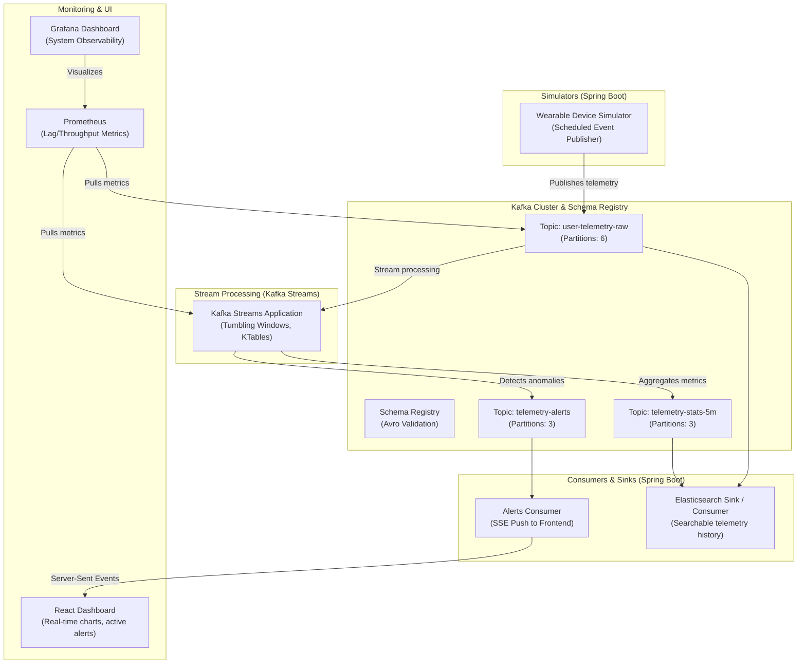
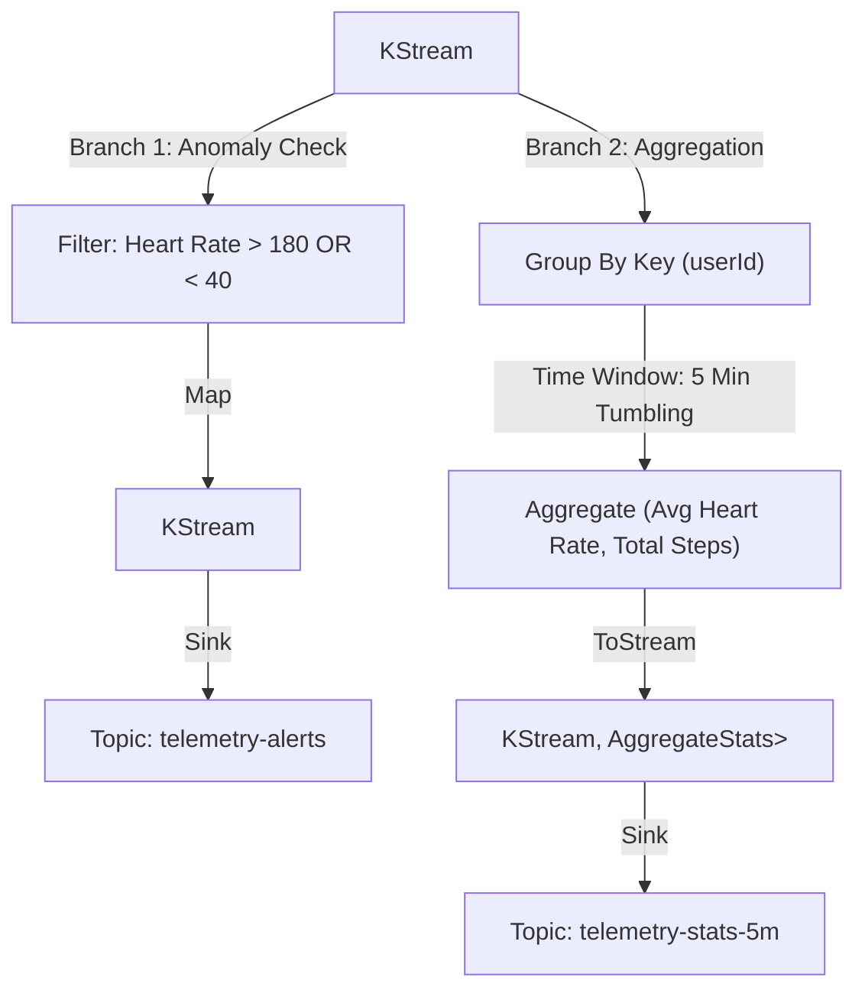

# EventFlow — Real-Time Fitness/IoT Telemetry Pipeline

> **Stack**: Spring Boot + Apache Kafka + Kafka Streams + Avro + Prometheus/Grafana  
> **Focus**: Master Apache Kafka internals, streaming topologies, schema registry, error handling, and telemetry monitoring.

---

## 1. System Architecture

EventFlow is designed to simulate, stream, aggregate, and alert on real-time smartwatch biometric telemetry.



---

## 2. Topic & Schema Design

To ensure data governance and type safety, the pipeline uses **Apache Avro** serialized schemas verified against a **Confluent Schema Registry**.

### Topic 1: `user-telemetry-raw`
* **Key**: `String` (UUID of the `device_id` / `user_id` to ensure partition ordering)
* **Value**: Avro Record `BiometricTelemetry`
* **Partitioning**: 6 Partitions (enables up to 6 parallel consumer threads in a group)

#### Avro Schema: `BiometricTelemetry.avsc`
```json
{
  "type": "record",
  "name": "BiometricTelemetry",
  "namespace": "com.eventflow.telemetry",
  "doc": "Raw telemetry event containing biometric details from smartwatch wearables",
  "fields": [
    { "name": "deviceId", "type": "string", "doc": "Unique hardware identifier" },
    { "name": "userId", "type": "string", "doc": "Associated user identifier" },
    { "name": "heartRate", "type": "int", "doc": "Beats per minute (BPM)" },
    { "name": "stepsDelta", "type": "int", "doc": "Steps taken since the last event" },
    { "name": "caloriesBurned", "type": "double", "doc": "Calories burned since the last event" },
    { "name": "timestamp", "type": "long", "doc": "Unix epoch timestamp in milliseconds" }
  ]
}
```

### Topic 2: `telemetry-alerts`
* **Key**: `String` (`userId`)
* **Value**: Avro Record `TelemetryAlert`

#### Avro Schema: `TelemetryAlert.avsc`
```json
{
  "type": "record",
  "name": "TelemetryAlert",
  "namespace": "com.eventflow.telemetry",
  "doc": "Alert schema emitted when biometric thresholds are crossed",
  "fields": [
    { "name": "alertId", "type": "string", "doc": "Unique alert UUID" },
    { "name": "userId", "type": "string", "doc": "Affected user identifier" },
    { "name": "alertType", "type": {
        "type": "enum",
        "name": "AlertType",
        "symbols": ["EXTREME_HEART_RATE", "DEHYDRATION_RISK", "ABRUPT_STOP"]
      }
    },
    { "name": "metricValue", "type": "double", "doc": "The value that triggered the alert" },
    { "name": "message", "type": "string", "doc": "Human readable alert message" },
    { "name": "timestamp", "type": "long", "doc": "Epoch timestamp of the trigger" }
  ]
}
```

---

## 3. Streaming Topologies (Kafka Streams DSL)

The core streaming processing uses **Kafka Streams** to perform windowed aggregations, lookups, and anomaly detection.



### Key Operations Implemented:
1. **Heart Rate Anomaly Filter**:
   Evaluates incoming heart rate data against safety thresholds (e.g., standard heart rates, or customized profiles joined from a User KTable). If heart rate exceeds limits (e.g. >180 BPM for a resting profile), it generates a `TelemetryAlert` and forwards it to the alert topic immediately.

2. **5-Minute Tumbling Aggregations**:
   Aggregates data over a non-overlapping 5-minute window to calculate:
   * Average heart rate
   * Total steps accumulated
   * Total calories burned
   
   This reduces the data velocity and feeds analytics queries.

3. **Windowed Joins (Optional Advanced Feature)**:
   Joins the telemetry stream with a static or slow-changing `users` KTable (loaded from a compacted topic) to retrieve the user's age, weight, and resting heart rate for personalized anomaly thresholds.

---

## 4. Error Handling & Reliability

IoT streams are prone to network noise, serialization issues, and schema mismatch. The project incorporates production-grade resiliency patterns:

```
                  ┌──────────────────────┐
                  │ Raw Telemetry Stream │
                  └──────────┬───────────┘
                             │
                  [Deserialization Check]
                   /                   \
            (Valid Avro)          (Corrupt Payload)
                 /                       \
    ┌───────────▼───────────┐     ┌───────▼──────────────┐
    │ Stream Processing     │     │ Dead Letter Queue    │
    │ Topology              │     │ (user-telemetry-dlq) │
    └───────────────────────┘     └──────────────────────┘
```

### Resilience Features

* **Error Handling Deserializer**:
  Using `ErrorHandlingDeserializer` combined with `KafkaAvroDeserializer`. This prevents a "poison pill" (unparseable payload) from permanently stalling consumer groups.
* **Dead Letter Queue (DLQ)**:
  Any message failing validation, schema matching, or parsing is automatically captured, enriched with custom headers (containing exception class, stack trace, and time of failure), and routed to `user-telemetry-dlq` for offline debugging.
* **Custom Production Exception Handler**:
  Kafka Streams application uses `DefaultProductionExceptionHandler` to handle transient network hiccups when publishing back to intermediate topics without crashing the application context.

---

## 5. Monitoring & Observability

Observability is a key component when working with event systems. We set up metrics collectors to monitor pipeline performance:

### Core Metrics to Track

| Metric | Source | Grafana Alert Condition |
|--------|--------|-------------------------|
| **Consumer Lag** | Kafka Consumer | Lag > 5000 records (indicates slow consumers) |
| **Active Thread Count** | Kafka Streams | Active threads < configured partitions |
| **Deserialization Failures** | Schema Registry / Consumer | Rate > 1/min (indicates schema issues) |
| **Bytes In/Out Rate** | Kafka Broker | System capacity alerts |

---

## 6. Phased Implementation Plan

### Phase 1: Ingestion & Simulator (Week 1-2)
* Spin up Kafka, Zookeeper/KRaft, and Schema Registry using **Docker Compose**.
* Build the Wearable Simulator app using Spring Boot scheduler.
* Define and compile Avro files using the `avro-maven-plugin`.
* Implement a robust Spring Boot publisher using `KafkaTemplate<String, BiometricTelemetry>`.

### Phase 2: Processing Topology (Week 3-4)
* Initialize the Kafka Streams application configuration.
* Write the DSL topologies for filtering, branching, and anomaly mapping.
* Write unit tests for your stream topologies using `TopologyTestDriver` (allows testing streams without spinning up actual brokers).
* Build the 5-minute tumbling aggregations.

### Phase 3: Consumer Layer & Alerts (Week 5-6)
* Build the alerts consumer using `@KafkaListener`.
* Implement a Server-Sent Events (SSE) controller in Spring Boot to push active alerts to a frontend application.
* Set up the Error Handling Deserializers and verified dead letter routing.

### Phase 4: Storage Sink & Monitoring (Week 7-8)
* Add a secondary consumer to stream telemetry logs into Elasticsearch for analytics search.
* Enable JMX exports on the Spring Boot applications and Kafka containers.
* Configure Prometheus scrape configurations and design a Grafana dashboard for real-time lag tracking and system metrics.

---

## 7. Local Infrastructure Setup

```yaml
version: '3.8'
services:
  zookeeper:
    image: confluentinc/cp-zookeeper:7.5.0
    environment:
      ZOOKEEPER_CLIENT_PORT: 2181

  kafka:
    image: confluentinc/cp-kafka:7.5.0
    depends_on:
      - zookeeper
    ports:
      - "9092:9092"
    environment:
      KAFKA_BROKER_ID: 1
      KAFKA_ZOOKEEPER_CONNECT: zookeeper:2181
      KAFKA_ADVERTISED_LISTENERS: PLAINTEXT://kafka:29092,PLAINTEXT_HOST://localhost:9092
      KAFKA_LISTENER_SECURITY_PROTOCOL_MAP: PLAINTEXT:PLAINTEXT,PLAINTEXT_HOST:PLAINTEXT
      KAFKA_OFFSETS_TOPIC_REPLICATION_FACTOR: 1

  schema-registry:
    image: confluentinc/cp-schema-registry:7.5.0
    depends_on:
      - kafka
    ports:
      - "8081:8081"
    environment:
      SCHEMA_REGISTRY_HOST_NAME: schema-registry
      SCHEMA_REGISTRY_KAFKASTORE_BOOTSTRAP_SERVERS: kafka:29092

  prometheus:
    image: prom/prometheus:v2.45.0
    ports:
      - "9090:9090"
    volumes:
      - ./prometheus.yml:/etc/prometheus/prometheus.yml

  grafana:
    image: grafana/grafana:10.0.3
    ports:
      - "3001:3000"
    depends_on:
      - prometheus
```
